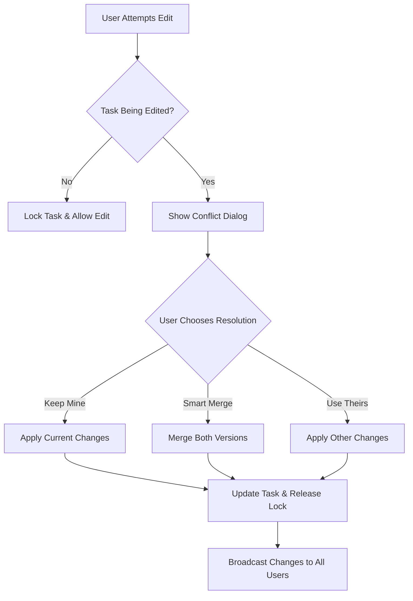

# 🧠 Logic Document: Smart Assignment & Conflict Resolution

## Overview

This document explains the core algorithms and logic behind the **Smart Assignment** and **Conflict Resolution** features in our Real-Time Collaborative Kanban To-Do Board application.

---

## 🎯 Smart Assignment Algorithm

### Purpose
The Smart Assignment feature automatically assigns tasks to the user with the **fewest active tasks**, ensuring balanced workload distribution across team members.

### Algorithm Logic

#### 1. Definition of "Active Tasks"
- **Active Tasks** = Tasks with status `"Todo"` OR `"In Progress"`
- **Excluded**: Tasks with status `"Done"` (completed tasks don't count toward workload)

#### 2. Smart Assignment Process

```javascript
// Pseudocode for Smart Assignment
function smartAssignTask(taskId) {
  // Step 1: Get all users in the system
  const allUsers = getAllUsers();
  
  // Step 2: Initialize task counter for each user
  const userTaskCounts = {};
  allUsers.forEach(user => {
    userTaskCounts[user.id] = 0;
  });
  
  // Step 3: Count active tasks per user
  const activeTasks = getTasksWithStatus(['Todo', 'In Progress']);
  activeTasks.forEach(task => {
    if (task.assignedTo) {
      userTaskCounts[task.assignedTo]++;
    }
  });
  
  // Step 4: Find user with minimum task count
  let minTaskCount = Infinity;
  let optimalUser = null;
  
  Object.entries(userTaskCounts).forEach(([userId, count]) => {
    if (count < minTaskCount) {
      minTaskCount = count;
      optimalUser = userId;
    }
  });
  
  // Step 5: Assign task to optimal user
  return assignTaskToUser(taskId, optimalUser);
}
```

#### 3. Edge Cases Handled

| Scenario | Behavior |
|----------|----------|
| **No users exist** | Return error: "No users found to assign task" |
| **Multiple users with same minimum count** | Assign to the first user found (deterministic) |
| **User with 0 active tasks exists** | Always prioritize users with 0 tasks |
| **All users have equal task counts** | Assign to any user (balanced distribution maintained) |

#### 4. Example Scenarios

**Scenario A: Balanced Distribution**
- User A: 2 active tasks
- User B: 1 active task  
- User C: 3 active tasks
- **Result**: Assign to User B (fewest: 1 task)

**Scenario B: New User**
- User A: 5 active tasks
- User B: 3 active tasks
- User C: 0 active tasks (new user)
- **Result**: Assign to User C (fewest: 0 tasks)

**Scenario C: Equal Distribution**
- User A: 2 active tasks
- User B: 2 active tasks
- User C: 2 active tasks
- **Result**: Assign to User A (first found, maintains balance)

---

## ⚡ Conflict Resolution System

### Purpose
Handle simultaneous editing of the same task by multiple users, preventing data loss and maintaining data integrity.

### Conflict Detection Logic

#### 1. Edit Session Tracking

```javascript
// Task model fields for conflict detection
{
  isBeingEdited: Boolean,     // Flag indicating active edit session
  editStartTime: Date,        // When editing started
  editingUser: ObjectId,      // Who is currently editing
  lastEditedBy: ObjectId,     // Last user to modify the task
  updatedAt: Date            // Last modification timestamp
}
```

#### 2. Conflict Detection Process

```javascript
function detectConflict(taskId, currentUserId) {
  const task = getTask(taskId);
  
  // Check if another user is currently editing
  if (task.isBeingEdited && 
      task.editingUser && 
      task.editingUser !== currentUserId) {
    
    return {
      hasConflict: true,
      editingUser: task.editingUser,
      editStartTime: task.editStartTime
    };
  }
  
  return { hasConflict: false };
}
```

#### 3. Real-time Conflict Notifications

- **Socket.IO Events** broadcast editing status
- Users receive immediate notifications when conflicts arise
- Visual indicators show which tasks are being edited

### Conflict Resolution Strategies

#### 1. Three Resolution Options

| Strategy | Description | Use Case |
|----------|-------------|----------|
| **Keep Mine** | Preserve current user's changes, discard others | User confident in their changes |
| **Smart Merge** | Intelligently combine both versions | Both users made valuable contributions |
| **Use Theirs** | Adopt other user's changes, discard current | Other user's changes are more comprehensive |

#### 2. Smart Merge Algorithm

```javascript
function smartMerge(currentVersion, conflictingVersion) {
  return {
    // Prioritize non-empty values from conflicting version
    title: conflictingVersion.title || currentVersion.title,
    description: conflictingVersion.description || currentVersion.description,
    status: conflictingVersion.status || currentVersion.status,
    priority: conflictingVersion.priority || currentVersion.priority,
    assignedTo: conflictingVersion.assignedTo || currentVersion.assignedTo
  };
}
```

#### 3. Conflict Resolution Flow



#### 4. Conflict Prevention Measures

- **Edit Locking**: Tasks are locked when editing begins
- **Auto-timeout**: Edit locks expire after inactivity
- **Visual Feedback**: Clear indicators of editing status
- **Real-time Updates**: Immediate synchronization across clients

### Advanced Conflict Scenarios

#### 1. Multi-field Conflicts

When users edit different fields simultaneously:

```javascript
// Example: User A edits title, User B edits description
const smartMergeResult = {
  title: userA.title,           // From User A
  description: userB.description, // From User B
  status: originalTask.status,   // Unchanged
  priority: originalTask.priority // Unchanged
};
```

#### 2. Cascading Conflicts

When conflicts affect related data:

- **Task Dependencies**: Check if changes affect dependent tasks
- **Status Changes**: Validate workflow rules during conflict resolution
- **Assignment Changes**: Ensure user assignment validity

#### 3. Conflict Logging

All conflict resolutions are logged for audit purposes:

```javascript
const conflictLog = {
  user: currentUserId,
  action: 'conflict_resolved',
  task: taskId,
  details: {
    resolutionStrategy: 'smart_merge',
    previousState: originalTask,
    newState: resolvedTask,
    conflictingUser: otherUserId,
    message: `Conflict resolved using ${strategy} by ${username}`
  }
};
```

---

## 🔄 Real-time Synchronization

### Socket.IO Event Handling

#### 1. Task Operations

| Event | Description | Payload |
|-------|-------------|---------|
| `taskCreate` | New task created | Complete task object |
| `taskUpdate` | Task modified | Updated task object |
| `taskDelete` | Task removed | Task ID |
| `taskAssign` | Task assigned/reassigned | Task with new assignment |
| `statusChange` | Task moved between columns | Task ID + new status |

#### 2. Conflict Management

| Event | Description | Payload |
|-------|-------------|---------|
| `taskEditing` | User starts editing | Task ID + User ID |
| `taskBeingEdited` | Conflict detected | Task ID + Editing user |
| `editCancelled` | User cancels edit | Task ID |

#### 3. Activity Logging

| Event | Description | Payload |
|-------|-------------|---------|
| `newLog` | New activity logged | Activity log entry |
| `userJoined` | User connects | User info |
| `userLeft` | User disconnects | User ID |

---

## 📊 Performance Considerations

### Smart Assignment Optimization

- **Caching**: User task counts cached for faster assignment
- **Bulk Operations**: Multiple assignments processed together
- **Database Indexing**: Optimized queries for task counting

### Conflict Resolution Optimization

- **Lock Timeouts**: Automatic release of stale edit locks
- **Debouncing**: Prevent rapid-fire conflict checks
- **Memory Management**: Efficient storage of conflict states

### Real-time Performance

- **Connection Pooling**: Efficient Socket.IO connection management
- **Event Batching**: Group related events for better performance
- **Selective Broadcasting**: Send updates only to relevant users

---

## 🧪 Testing Scenarios

### Smart Assignment Tests

1. **Load Balancing**: Verify even distribution across users
2. **Edge Cases**: Handle empty user lists, equal distributions
3. **Performance**: Test assignment speed with large user bases
4. **Accuracy**: Ensure correct counting of active vs. completed tasks

### Conflict Resolution Tests

1. **Simultaneous Edits**: Multiple users editing same task
2. **Network Interruptions**: Handle disconnections during conflicts
3. **Resolution Accuracy**: Verify merge logic correctness
4. **Lock Management**: Test timeout and release mechanisms

### Integration Tests

1. **End-to-End Workflows**: Complete user scenarios
2. **Real-time Sync**: Multi-client synchronization
3. **Data Integrity**: Ensure no data loss during conflicts
4. **Performance Under Load**: System behavior with many concurrent users

---

## 🚀 Future Enhancements

### Smart Assignment Improvements

- **Skill-based Assignment**: Consider user expertise for task types
- **Workload Weighting**: Factor in task complexity/priority
- **Time-based Distribution**: Consider user availability and time zones
- **Machine Learning**: Learn from user preferences and performance

### Conflict Resolution Enhancements

- **Automatic Resolution**: AI-powered conflict resolution
- **Field-level Granularity**: More precise conflict detection
- **Collaborative Resolution**: Multi-user conflict resolution sessions
- **Version History**: Complete change tracking and rollback capability

### Real-time Features

- **Presence Indicators**: Show who's currently online
- **Cursor Sharing**: See where other users are working
- **Voice Chat Integration**: Real-time communication during conflicts
- **Notification System**: Advanced alert mechanisms

---

## 📝 Conclusion

The Smart Assignment and Conflict Resolution systems provide a robust foundation for collaborative task management. The algorithms ensure:

- **Fair Distribution**: Balanced workload across team members
- **Data Integrity**: No loss of work during simultaneous edits
- **User Experience**: Smooth, intuitive conflict resolution
- **Scalability**: Efficient performance with growing user bases

These systems work together to create a seamless collaborative environment where teams can work efficiently without worrying about technical conflicts or workload imbalances. 